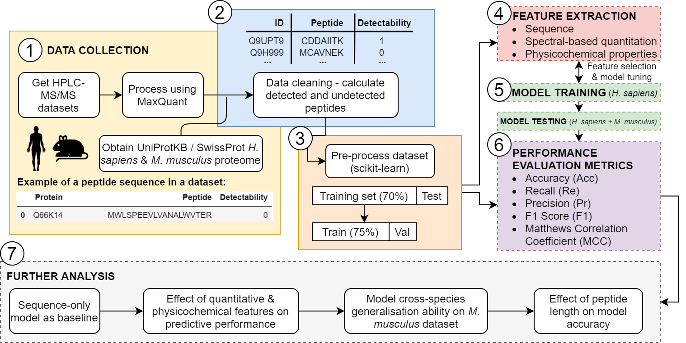

# peptide-detectability-predictor
This work formed my MSc Bioinformatics research project at Queen Mary, University of London, and was undertaken in the Bessant Lab.

The aim of this project was to improve peptide detectability prediction, with a particular focus on feature selection and determining which features improve model performance. This project is based on prior work which established a transformer network with optimised hyperparameters determined through grid search and simplex optimisation methods.

The outcome of this project was a sample-specific Transformer-based peptide detectability predictor, that can learn the intrinsic context of a sample, and is trained on sequence, spectral-count (SpC)-based abundance features and physicochemical properties obtained through the AAIndex database.

This study used two experimentally validated datasets from two different species – the first being the <i>Homo sapiens</i> (PTEN) dataset, kindly provided by the labs of Dr Prabhakar Rajan and Dr Faraz Mardakheh at Cancer Research UK Barts Centre. The second dataset being from <i>Mus musculus</i>, was obtained from the PRIDE Database (dataset identifier: PXD027822).

The model was developed using Python (v3.8.8), Keras (v2.6.0) and scikit-learn (v0.24.1). A schematic overview of the experimental methodology is outlined below:

